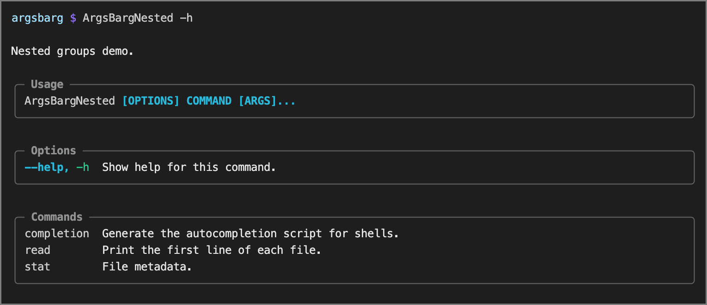
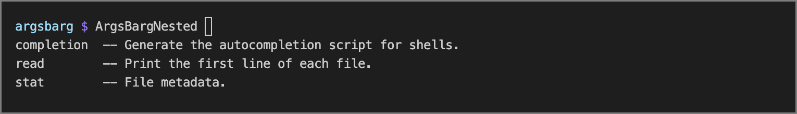

<!-- Big money NE - https://patorjk.com/software/taag/#p=testall&f=Bulbhead&t=shebangsy&x=none&v=4&h=4&w=80&we=false> -->

[](https://github.com/bdombro/swift-argsbarg)

[](https://github.com/bdombro/swift-argsbarg/actions/workflows/ci.yml) [](LICENSE)

[](https://swiftpackageindex.com/bdombro/swift-argsbarg) [](https://swiftpackageindex.com/bdombro/swift-argsbarg)

Build beautiful, well-behaved CLI apps in Swift — **no third-party runtime dependencies**, just add the **ArgsBarg** package.

Vs. [Swift ArgumentParser](https://github.com/apple/swift-argument-parser), **ArgsBarg** is *schema-first* -- define your entire CLI’s structure, commands, options, and help in a single, explicit data model, making the command-line interface centralized, clear and self-describing upfront. `swift-argsbarg` has siblings --> [bun](https://github.com/bdombro/bun-argsbarg), [cpp](https://github.com/bdombro/cpp-argsbarg), [nim](https://github.com/bdombro/nim-argsbarg).

Halps! -->


Sub-level Halps! -->


Shell completions! -->


## What is it?

Everything you need for a first-class CLI:

- Nested subcommands (`CliCommand` with `children` for groups, `handler` for leaves)
- POSIX-style options (`-x`, `--long`, `--long=value`)
- Bundled presence flags (`-abc`)
- Positional arguments and varargs tails (`CliOption` with `positional: true`)
- Scoped help at any routing depth (`-h` / `--help`)
- Default-command fallback (`CliFallbackMode`)
- Rich help: rounded UTF-8 boxes, tables, terminal width via `TIOCGWINSZ`, colors when stdout/stderr is a TTY

## Platforms and stability

- **Platforms:** macOS (see `Package.swift` `platforms`). The implementation uses POSIX APIs (`ioctl`, `isatty`) matching the C++ library. Linux builds are not declared in the manifest but may work when built with Swift on Linux.
- **Swift:** 5.9+
- **API stability:** pre-1.0 SemVer — minor versions may include breaking changes. See [`CHANGELOG.md`](CHANGELOG.md).

---

## Usage

```swift
import Foundation
import ArgsBarg

let cli = CliCommand(
    name: "ArgsBargSingleCommand",
    description: "A simple single-command CLI.",
    options: [
        CliOption(
            name: "verbose",
            description: "Enable verbose output.",
            shortName: "v"
        )
    ],
    positionals: [
        CliOption(
            name: "target",
            description: "The target file or directory.",
            positional: true
        )
    ],
    handler: { ctx in
        let target = ctx.args[0]
        let verbose = ctx.flag("verbose")
        print("Running single-command CLI...")
        print("Target: \(target)")
        print("Verbose: \(verbose)")
    }
)

cliRun(cli)
```

`cliRun` parses `CommandLine.arguments`, prints help or errors, dispatches the leaf handler, and **exits the process** (like the C++ `run()`).

---

## Built-ins

Every app gets:

- `-h` / `--help` at any routing depth (scoped help).
- **`completion bash` / `completion zsh`** — print shell completion scripts to stdout (injected by `cliRun`).

Do not declare a top-level command named **`completion`** — it is reserved for this built-in.

### Shell completions

```bash
myapp completion bash                             > ~/.bash_completion.d/myapp
# or: source <(myapp completion bash)
myapp completion zsh                              > ~/.zsh/completions/_myapp   # then: fpath+=(~/.zsh/completions); autoload -Uz compinit && compinit
```

---


## Install (Swift Package Manager)

In `Package.swift`:

```swift
dependencies: [
    .package(url: "https://github.com/bdombro/swift-argsbarg.git", from: "0.4.0"),
],
targets: [
    .target(
        name: "YourTarget",
        dependencies: [
            .product(name: "ArgsBarg", package: "swift-argsbarg"),
        ]
    ),
]
```

---

## How it works

1. Build a **program root** `CliCommand`: `name` is the app/binary name, `options` are global flags.
   - For a **single-command CLI**, set the `handler` directly on the root. The root is treated as a leaf and may declare `positionals`.
   - For a **multi-command CLI**, provide `children` for subcommands. The root must not set a `handler` or declare `positionals` (validated at startup). Use `fallbackCommand` / `fallbackMode` on the root for default routing.
2. Call `cliRun(_:)` with that root — validates, parses argv, renders help or errors, invokes the leaf handler, `exit`s with status **0** on success, **1** on implicit help or error (explicit `--help` → **0**).
3. From a handler, `cliErrWithHelp(ctx, "message")` prints a red error line plus contextual help on stderr and exits **1**.

### Fallback modes (`CliFallbackMode`)

| Mode | Empty argv | Unknown first token |
| --- | --- | --- |
| `missingOnly` | Default command | Error |
| `missingOrUnknown` | Default command | Default command (token becomes argv for the default) |
| `unknownOnly` | Root help (exit 1) | Default command |

With `missingOrUnknown` / `unknownOnly`, unrecognized **root** flags stop root-flag consumption and the remainder is passed to the default command (same as cpp-argsbarg §5.3).

### Positionals (help labels)

Use `CliOption` with `positional: true`. With `argMax == 0`, the tail accepts at least `argMin` tokens and has no upper bound unless you set `argMax` > 0.

| Fields | Label |
| --- | --- |
| `positional: true`, default `argMin`/`argMax` | `<n>` |
| `positional: true`, `argMin: 0`, `argMax: 1` | `[n]` |
| `positional: true`, `argMin: 0`, `argMax: 0` | `[n...]` |
| `positional: true`, `argMin: 1`, `argMax: 0` | `<n...>` |

### Reading values (`CliContext`)

- `ctx.flag("verbose")` — presence options.
- `ctx.stringOpt("name")` / `ctx.numberOpt("count")` — `String?` / `Double?`.
- `ctx.reqStringOpt("name")` — `String` (safe access when `required: true`).
- `ctx.args` — positional words in order.
- `ctx.schema` — merged program root (`CliCommand`) for contextual help.

---

## Examples

Shipped executable targets (see `Package.swift`):

| Target | Directory | Shows |
| --- | --- | --- |
| `ArgsBargMinimal` | `Examples/Minimal/` | String + presence flags, `missingOrUnknown` fallback. |
| `ArgsBargNested` | `Examples/Nested/` | Nested `CliCommand` tree, positional tails, `unknownOnly` fallback. |
| `ArgsBargOptionRequired` | `Examples/OptionRequired/` | Using `required: true` on an option and `reqStringOpt`. |
| `ArgsBargSingleCommand` | `Examples/SingleCommand/` | Single-command CLI using a root `handler` and root positionals. |

```bash
swift run ArgsBargMinimal --help
swift run ArgsBargMinimal --name world
swift run ArgsBargNested stat owner lookup -u alice ./README.md
swift run ArgsBargNested ./README.md
```

---

## Public API overview

| Symbol | Role |
| --- | --- |
| `CliCommand`, `CliOption`, `CliOptionKind`, `CliFallbackMode` | Schema types (`Cli*`-prefixed public types). |
| `CliContext`, `CliHandler` | Handler context and closure type. |
| `cliRun(_:)` | Parse argv, dispatch, exit. |
| `cliErrWithHelp(_:_:)` | Error + scoped help, exit 1. |
| `cliHelpRender(schema:helpPath:useStderr:)` | Render help (`schema` is the program root `CliCommand`). |
| `cliArgsBargVersion` | Semver string. |

Reserved identifier (validated at startup): root command **`completion`**.

Internal parsing (`parse`, `postParseValidate`, `cliValidateRoot`) is `internal`; use `@testable import ArgsBarg` in tests. Nested commands must not set `fallbackCommand` or a non-default `fallbackMode` until per-group fallback is implemented.

---

## Contributing

See [`CONTRIBUTING.md`](CONTRIBUTING.md). Security: [`SECURITY.md`](SECURITY.md). Code of conduct: [`CODE_OF_CONDUCT.md`](CODE_OF_CONDUCT.md).

---

## License

MIT — see [`LICENSE`](LICENSE).
